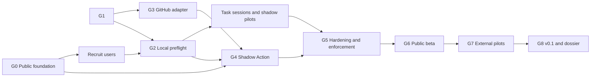

# Kế hoạch thực thi PatchGate cho quy trình tự động

**Phiên bản kế hoạch:** 2.0  
**Ngày chốt bằng chứng:** 2026-08-22
**Phạm vi:** từ local evaluator prototype đến public OSS `v0.1`, hai pilot bên
ngoài và hồ sơ Codex for Open Source có bằng chứng  
**Authority cao nhất:** `PROJECT_CONSTITUTION.md`  
**Product acceptance:** `docs/product/user-requirements.md`

Khi phần cũ mâu thuẫn với roadmap 2.0 hoặc backlog version 2,
`docs/implementation-roadmap.md` và `docs/agent-work-packages.yml` là nguồn
thực thi mới hơn; constitution vẫn cao nhất.

## Current checkpoint — 2026-08-22

Đây là checkpoint vận hành mới nhất. Các bảng snapshot ngày 13/08 bên dưới
được giữ lại để truy nguyên quyết định, nhưng không được dùng để phủ nhận bằng
chứng mới hơn trong checkpoint này.

| Gate/surface | Mức hiện tại | Bằng chứng | Phần còn thiếu |
| --- | --- | --- | --- |
| G0 public foundation | Đã có nền tảng public, chưa hoàn tất release | Remote `origin` trỏ tới public repo `daichunghy/patchgate`; Apache-2.0, community files, CI và public `main` run thành công | package vẫn `private`, chưa có release, chưa có hoạt động support/security public và chưa có usage/pilot |
| G1 contract | Locally verified | evaluator, schema, digest, fixture, security và deterministic tests; `npm run verify` là lệnh kiểm chứng chính | live provenance |
| G2 onboarding | Native local flow verified | preflight, validate, init, doctor, Git-ref, discovery, text/JSON và 5 CLI process tests | 3 task sessions, UR acceptance |
| G3 adapter | Current PR head live snapshot verified | snapshot recorded/mock, bounded API behavior, source/SHA binding, TOCTOU, redaction, native-control subset, 25 integration tests và current GET-only smoke | post-merge default-branch smoke, merge-group/native-control limitations |
| G4 Action | Public PR candidate verified | source runner, committed ncc bundle, pinned workflows, clean-room `verify:dist`, idempotent check delivery và Full Verify CI | consumer E2E, fork/merge-group E2E và 2 shadow installations |
| User value/release | Chưa được chứng minh | protocol, roadmap và product requirements | sessions, shadow, pilots, release và external feedback |

Không được gọi dự án là đã live-integrated, đã pilot, đã phát hành hoặc
merge-blocking từ các bằng chứng trên. `human_review_required` vẫn chỉ là trạng
thái cho biết human gate được khai báo nhưng chưa thỏa, không phải bằng chứng
con người đã review.

## Agent-scaling checkpoint — 2026-08-27

Phần local của quy trình agent đã được đưa vào repository contract:

- [agent verification map](agent-verification-map.md) quy định authority order,
  path ownership, verification ladder, PR invariants và bounded parallel work;
- [agent evaluation protocol](agent-evaluation-protocol.md) quy định task
  corpus, rubric, wave promotion và evidence record;
- `fixtures/agent-evals/manifest.json` chứa mười task `AG-01` đến `AG-10`;
- `npm run agent-eval -- <task-id>` chạy acceptance commands allowlisted;
- `check:agent-contract` nằm trong `npm run verify`.

Wave A baseline đã chạy trên current tree với `AG-01`, `AG-04`, `AG-08` và
`AG-09`. Kết quả này chỉ là local workflow evidence. Không được dùng nó để
claim agent authorship quality, external pull request, pilot, release hoặc
auto-merge. Các task `AG-02`, `AG-03`, `AG-05`, `AG-06`, `AG-07` và `AG-10`
phải tiếp tục qua parent verification do chạm evaluator, evidence, GitHub,
Action, security hoặc release boundary.

## 1. Kết luận điều hành

PatchGate nên tiếp tục theo định vị hiện tại: một **review-readiness gate có
authority rõ ràng và fail-closed**, không phải công cụ xác định nguồn gốc mã nguồn,
không phải code-review oracle và không phải SaaS compliance.

Đường tối ưu để tăng xác suất được hỗ trợ từ Codex for Open Source không phải là
thêm suy đoán về nguồn gốc mã nguồn vào evaluator. Đường đúng là biến PatchGate
thành một public project có
license, release dùng được, trust boundary đã kiểm thử, ít nhất hai maintainer
bên ngoài đã pilot và một hồ sơ chứng minh người nộp là core maintainer có hoạt
động thực tế.

Trang chính thức hiện hành nêu ba quyền lợi có thể xin:

- sáu tháng ChatGPT Pro với Codex;
- Codex Security theo xét duyệt từng trường hợp;
- API credits cho các project dùng Codex trong PR review, maintainer automation,
  release workflows hoặc công việc OSS cốt lõi.

Trang cũng nói core maintainer hoặc người vận hành một public project được dùng
rộng rãi nên nộp; project quan trọng nhưng chưa khớp hoàn toàn vẫn có thể nộp và
giải thích vai trò. Đây là điều kiện hướng dẫn, không phải cam kết phê duyệt.

Nguồn chính thức: [Codex for Open Source](https://developers.openai.com/community/codex-for-oss).

## 2. Baseline kế hoạch ngày 2026-08-13 (lưu để truy nguyên)

Các bảng trong mục này phản ánh snapshot trước khi repository public và Action
candidate được bổ sung. Khi có mâu thuẫn, mục `Trạng thái hiện tại` và
`docs/implementation-roadmap.md` có bằng chứng mới hơn được ưu tiên.

### 2.1 Phần đã hoạt động

| Hạng mục | Bằng chứng hiện tại | Mức kết luận |
| --- | --- | --- |
| Evaluator thuần | `src/evaluator.ts` | Local prototype |
| Policy loader | `src/policy.ts` và `patchgate.example.yml` | Local prototype |
| Revision model | `baseSha`, `headSha`, `testedSha`, `targetKind` | Có type và fixture |
| Receipt | Full JSON Schema, runtime validation, deterministic digests | Local contract slice |
| Test | 49 non-CLI và 4 CLI process test pass | Unit, schema, determinism, security, fixture và CLI coverage |
| Quality commands | lint, typecheck, test, build đều pass | Local only |
| Dependency audit | 0 vulnerability ngày 2026-08-13 | Snapshot, cần chạy lại khi release |
| Research | landscape, deep dive, threat model | Design evidence |

### 2.2 Khoảng trống phải xử lý trước public beta

| Mức | Khoảng trống | Hệ quả nếu bỏ qua |
| --- | --- | --- |
| P0 | Workspace chưa là Git repository, chưa có public remote | Chưa phải public OSS project |
| P0 | Không có `LICENSE` | Người khác chưa có quyền OSS rõ ràng |
| P0 | `package.json` đang `private: true` | Không thể phát hành package công khai |
| Đã đóng local | Observation completeness/permission metadata | Contract/fixture đã có; live adapter provenance vẫn thiếu |
| P0 | Không có GitHub adapter/Action | Chưa giải quyết use case thật |
| P1 | Preflight chỉ nhận local path, chưa nhận Git ref | Chưa đúng trải nghiệm được quảng bá |
| P1 | Chưa phân loại prose discovery | Chưa hoàn thành ranh giới discovery/enforcement |
| P1 | Chưa có CODEOWNERS/native rule adapter | Chưa đủ sáu rule class ở live flow |
| P1 | Chưa có security/integration/E2E tests | Chưa chứng minh trust boundary |
| P1 | Chưa có community-health và release artifacts | Khó có contributor/pilot đáng tin |
| P1 | Chưa có external pilot | Differentiation và nhu cầu mới là giả thuyết |
| P1 | Chưa có `init`/`validate`/`doctor` và task-based usability proof | Người dùng có thể bỏ cuộc trước khi thấy giá trị |
| P1 | Pilot trong plan cũ chỉ bắt đầu sau beta | Feedback quan trọng đến quá muộn |

## 3. Mục tiêu và thước đo

### 3.1 Mục tiêu sản phẩm bắt buộc

`v0.1` phải cho phép một maintainer:

1. chạy preflight trên repository và hiểu nguồn nào enforced, advisory hoặc
   needs confirmation;
2. cài Action metadata-only mà không chạy PR code trong privileged lane;
3. nhận `ContributionReceipt` bind đúng base/head/tested SHA và source;
4. thấy remediation cụ thể cho mọi trạng thái không xanh;
5. tái tạo quyết định từ fixture tương thích;
6. dùng PatchGate trên repository thật mà không có false green ở các case đã
   định nghĩa trong threat model.
7. bắt đầu bằng local preflight hoặc shadow mode trước enforcement;
8. chẩn đoán permission/capability theo requirement;
9. nhận một check idempotent, ít nhiễu, có human/JSON parity;
10. tạo redacted diagnostic bundle để nhận hỗ trợ an toàn.

### 3.2 Mục tiêu OSS và hồ sơ chương trình

Trước khi chuẩn bị nộp hồ sơ, phải có tối thiểu:

- public GitHub repository với license rõ ràng;
- người nộp có quyền write và hoạt động core-maintainer có thể kiểm chứng;
- ít nhất một beta và một `v0.1.0` release hoặc release candidate đủ ổn định;
- hai public pilot repositories khác hình dạng;
- feedback thật được chuyển thành issue, fixture hoặc change log;
- tài liệu cài đặt, permissions, security, rollback và unsupported behavior;
- mô tả cụ thể ChatGPT Pro/Codex sẽ giúp coding, triage, review và maintenance;
- nếu xin API credits, một use case OSS thực tế, chi phí dự kiến và dữ liệu không
  nhạy cảm; không tạo API feature giả chỉ để xin credits.

### 3.3 Chỉ số pilot

| Chỉ số | Định nghĩa |
| --- | --- |
| False-green | Kết quả xanh khi authority, SHA, source hoặc evidence không hợp lệ; mục tiêu bằng 0 |
| Unknown rate | `evidence_missing` hoặc `policy_ambiguous` / tổng evaluation |
| False-block | Maintainer xác nhận gate không cần thiết / tổng enforcement result |
| Source rejection | Foreign/duplicate source bị loại đúng / tổng test source |
| Stale rejection | Evidence cũ bị loại đúng / tổng stale cases |
| Replay rate | Receipt tái tạo cùng core digest / tổng fixture tương thích |
| Remediation clarity | Maintainer chấm `clear`, `partial`, `unclear` |
| Setup time | Thời gian từ clone/cài đến receipt đầu tiên |
| Task completion | Hoàn thành preflight/config/doctor không cần maintainer cứu |
| Delivery noise | Check/comment trùng cho cùng semantic evaluation |
| API budget | Request, page, retry và rate-limit state mỗi evaluation |
| Review decision | Review, remediation, handoff, deliberate bypass hoặc no-go |

### 3.4 Persona và user journey

Mọi work package user-facing phải map vào UR IDs trong
[user requirements](product/user-requirements.md). Persona ưu tiên là OSS
maintainer, contributor hoặc công cụ tự động, security/platform owner và
monorepo/domain owner. Flow bắt buộc gồm local value, contributor remediation,
shadow rollout, actionable PR result, administrator diagnosis và replay/support.

## 4. Kiến trúc đích cho `v0.1`

```text
src/
  action/
    index.ts                 # Action entrypoint; metadata-only
    inputs.ts                # fail-on and output parsing
    summary.ts               # derived job summary, never authority source
  cli/
    index.ts
    preflight-command.ts
    evaluate-command.ts
    output.ts
  contract/
    evaluation-input.ts
    observation.ts
    policy.ts
    receipt.ts
    status-precedence.ts
  discovery/
    scan-guidance.ts
    classify-guidance.ts
    conflicts.ts
  evaluator/
    evaluate.ts
    issue-linkage.ts
    required-checks.ts
    ownership.ts
    human-handoff.ts
    policy-integrity.ts
    reviewability.ts
  evidence/
    canonical-json.ts
    decision-digest.ts
    source-verifier.ts
    target-resolver.ts
  github/
    client.ts
    snapshot-builder.ts
    contents.ts
    pull-request.ts
    changed-paths.ts
    linked-issues.ts
    reviews.ts
    checks.ts
    workflows.ts
    rulesets.ts
    branch-protection.ts
    codeowners.ts
    permissions.ts
    pagination.ts
    retry.ts
    toctou.ts
  policy/
    load-base-policy.ts
    parse-policy.ts
    validate-policy.ts
  risk/
    reviewability.ts
schemas/
  patchgate-policy.schema.json
  evaluation-input.schema.json
  contribution-receipt.schema.json
fixtures/
  repositories/
  api/
  evaluator/
  security/
test/
  unit/
  fixture/
  integration/
  security/
  e2e/
.github/
  workflows/
    ci.yml
    security.yml
    action-e2e.yml
  ISSUE_TEMPLATE/
  pull_request_template.md
action.yml
```

Không cần di chuyển toàn bộ file ngay. Refactor phải theo vertical slice để mỗi
commit vẫn build và test được.

### 4.1 Contract observation bắt buộc

Mỗi nhóm dữ liệu từ GitHub cần metadata tương đương:

```ts
interface ObservationMeta {
  source: string;
  revision?: string;
  retrievedAt: string;
  complete: boolean;
  permissionState: "sufficient" | "insufficient" | "unknown";
  responseDigest?: string;
}
```

`retrievedAt` thuộc audit envelope, không thuộc core decision digest. Trong
vertical slice hiện tại, nó vẫn nằm trên `CheckEvidence` để bảo toàn provenance
ở boundary; `src/evidence/digests.ts` tạo semantic projection loại trường này.
`complete`
hoặc `permissionState` không đạt phải tạo `unknown`, không được tự động pass.

### 4.2 Contract digest bắt buộc

Tách ba digest:

- `policyDigest`: raw trusted policy bytes tại base SHA;
- `decisionInputDigest`: normalized decision inputs, loại delivery timestamp,
  URL tạm thời và field không ảnh hưởng semantics;
- `receiptDigest`: canonical receipt core, không chứa `evaluatedAt`.

Schema version hoặc evaluator version thay đổi semantics phải có compatibility
fixture và migration note.

### 4.3 Trạng thái cuối

Không để precedence phát sinh ngẫu nhiên từ thứ tự `if`. Viết bảng quyết định và
test tổ hợp tối thiểu:

1. authority/policy không xác định;
2. evidence không đầy đủ;
3. human gate chưa thỏa;
4. enforceable rule failed;
5. advisory only;
6. all passed.

Nếu nhiều nguyên nhân đồng thời, receipt giữ tất cả requirement results; final
status dùng precedence được tài liệu hóa và không che remediation quan trọng.

## 5. Các gate triển khai

## G0 — Nền tảng public OSS

**Mục tiêu:** tạo project hợp pháp, version-controlled và contributor-ready.

### Công việc

- `PG-001`: người duy trì chọn owner/repository slug và xác nhận quyền publish.
- `PG-002`: khởi tạo Git repository, default branch `main`, commit baseline.
- `PG-003`: chọn license OSI; khuyến nghị cân nhắc Apache-2.0 cho công cụ hạ tầng
  có patent grant, nhưng quyết định license thuộc maintainer.
- `PG-004`: thêm `CONTRIBUTING.md`, `SECURITY.md`, `CODE_OF_CONDUCT.md`,
  `SUPPORT.md`, issue forms và PR template.
- `PG-005`: thêm CI cho lint, typecheck, test, build và package smoke test.
- `PG-006`: cấu hình branch ruleset sau khi CI ổn định; không khóa maintainer
  khỏi recovery path.
- `PG-007`: tạo public remote sau khi kiểm tra secret, lịch sử và tên package.
- `PG-008`: tạo consent-safe user-research protocol.
- `PG-009`: tuyển candidate maintainers cho G2 tasks và G4 shadow, không gọi đó
  là adoption hay completed pilot.

### Gate evidence

- `git status` sạch; default branch và remote đúng;
- public URL truy cập được;
- GitHub nhận diện license và community profile;
- PR từ branch chạy CI xanh;
- secret scan không có credential;
- README nói đúng trạng thái prototype.
- public feedback/private-security routes dùng được;
- research protocol và candidate-state log phân biệt invitation, session,
  shadow và enforcement.

## G1 — Contract deterministic và runtime-safe

**Mục tiêu:** không dữ liệu sai hoặc không đầy đủ nào được cast thành sự thật.

### Công việc

- `PG-101`: đóng đầy đủ policy/input/receipt JSON Schemas.
- `PG-102`: runtime validation tại CLI và adapter boundary; lỗi trả exit code và
  diagnostic ổn định.
- `PG-103`: tách decision digest khỏi audit/delivery timestamps.
- `PG-104`: thêm `receiptDigest` và test canonicalization.
- `PG-105`: định nghĩa status precedence bằng table-driven tests.
- `PG-106`: phát hiện duplicate rule ID, empty conclusions, invalid count,
  unknown field và unsupported schema version.
- `PG-107`: thay `find()` trong check selection bằng candidate resolution:
  source filter, SHA filter, duplicate policy và explicit ambiguity.
- `PG-108`: thêm observation completeness/permission/provenance.
- `PG-109`: đảm bảo missing linked-issue data khác với confirmed no linkage.
- `PG-110`: compatibility fixtures cho schema `0.1`.

### Gate evidence

```bash
npm run verify
npm run build
npm run test:fixtures
npm run test:schema
npm run test:determinism
```

- cùng semantic input cho cùng `decisionInputDigest` và `receiptDigest`;
- đổi `retrievedAt` hoặc `evaluatedAt` không đổi decision digest;
- duplicate/foreign/stale evidence không xanh;
- malformed input không vào evaluator.

### Prompt 2 technical checkpoint (2026-08-13)

The local G1 corrective slice implements PG-108, PG-109 and PG-110 evidence:

- versioned evaluation input, independent receipt/evaluator versions, and
  runtime rejection of unversioned or unsupported input;
- observation metadata for policy sources, changed paths, linked issues,
  reviews, checks, ownership and reviewability, including completeness,
  permission, source/revision and recomputed normalized digests;
- raw policy digest plus normalized contract digest from one trusted-artifact
  constructor;
- immutable check-run/workflow and review/actor/team identities with
  dependency-aware missing/failed/unknown semantics;
- a pure `evaluateValidated` core and a delivery envelope that injects the
  required `evaluatedAt` timestamp;
- receipt evidence references, human-gate/team qualification consistency checks,
  and a 50-entry executable fixture manifest with exact reject/evaluate/assert
  oracles plus process-level CLI smoke tests.

This remains local evaluator evidence. It does not prove authenticated GitHub
retrieval, GitHub permissions, Action safety, merge protection, or source
authenticity. Roadmap 2.0 records G1 as `locally_verified` and tracks the G0
repository/license/publication decision independently.

## G2 — Local preflight có ích

**Mục tiêu:** con người và công cụ tự động biết yêu cầu trước khi mở PR.

### Công việc

- `PG-201`: hỗ trợ `--base <git-ref>` và tùy chọn rõ ràng cho local file.
- `PG-202`: đọc policy từ base ref, không từ working tree/head một cách ngầm.
- `PG-203`: scan `AGENTS.md`, `CONTRIBUTING.md`, `SECURITY.md`, README và PR
  template dưới dạng discovery-only.
- `PG-204`: phân loại `enforced`, `advisory`, `needs_confirmation`, `unsupported`.
- `PG-205`: phát hiện xung đột prose với `patchgate.yml` nhưng không nâng prose
  thành block.
- `PG-206`: output human-readable và `--json` dùng cùng internal contract.
- `PG-207`: fixture repositories cho missing policy, head-only policy, digest
  mismatch, conflicting prose và unsupported guidance.
- `PG-208`: safe draft `init` và explicit policy `validate`.
- `PG-209`: `doctor` cho base/source/capability/permission/unsupported state.
- `PG-210`: text, JSON, diagnostics và remediation dùng cùng semantics.
- `PG-211`: ba task-based usability sessions trước khi freeze interface.
- `PG-212`: đóng mọi P0/P1 onboarding/explanation finding.

Local onboarding checkpoint đã có:

- human/JSON `preflight`;
- safe draft `init` không overwrite;
- `validate` với stable policy diagnostic;
- local `doctor` cho policy/Git/package/network capability;
- explicit `local_file`/`git_ref` modes, Git-object policy loading and
  discovery-only guidance diagnostics;
- committed preflight fixture repositories for missing policy, base-versus-
  working-tree policy, conflicting prose and unsupported guidance.

Bốn process-level CLI tests đã khóa flow này. G2 vẫn chưa complete vì
three-session evidence và UR acceptance evidence còn thiếu.

### Gate evidence

- preflight trên fixture có output ổn định;
- thay policy ở working tree không thay authority của base ref;
- advisory prose không tạo exit code blocking;
- mỗi ambiguity có remediation cụ thể.
- `init` không bật enforcement hoặc chuyển prose thành rule;
- common failure không đòi đọc raw JSON;
- ba session có raw time, completion, comprehension và backlog mapping.

## G3 — GitHub metadata adapter

**Mục tiêu:** tạo normalized snapshot hoàn chỉnh từ API authenticated.

Execution artifact: [Prompt 4 — authenticated GitHub adapter](prompts/prompt-04-authenticated-github-adapter.md).
Prompt này yêu cầu mock/recorded integration trước, ba subagents read-only và
authorized live read-only smoke trước khi gọi G3 complete.

### Vertical slices

1. `PG-301` identity: repository, PR, base/head/merge/merge-group target.
2. `PG-302` contents: base `patchgate.yml`, digest và policy-change paths.
3. `PG-303` changed paths: pagination, 3,000-file cap và completeness.
4. `PG-304` linked issues: GitHub metadata; regex body chỉ advisory.
5. `PG-305` checks/workflows: status, conclusion, SHA, App/workflow identity,
   run attempt và duplicate candidates.
6. `PG-306` reviews: active final state, commit freshness, author/bot exclusion.
7. `PG-307` permission/team qualification: đủ quyền mới đặt `qualified: true`.
8. `PG-308` CODEOWNERS tại base; parser subset phải công bố limitation hoặc dùng
   native semantics khi có thể.
9. `PG-309` rulesets và branch protection với inherited/bypass diagnostics.
10. `PG-310` bounded retry, rate limit, 403/404/5xx mapping.
11. `PG-311` TOCTOU: đọc identity đầu và cuối; discard nếu head/target đổi.
12. `PG-312` redaction: không lưu token, PR body hoặc comment nhạy cảm vào receipt.
13. `PG-313` capability diagnostics theo requirement.
14. `PG-314` request/page/retry/rate-limit budgets.
15. `PG-315` conditional request/caching không vượt identity boundary.

### Gate evidence

- recorded/mock fixtures cho happy path và mọi incomplete path;
- read-only smoke test trên disposable public repository;
- pagination test nhiều trang;
- permission-insufficient test;
- head đổi giữa evaluation bị discard;
- adapter không chạy repository code.

### 2026-08-13 implementation checkpoint

The local/mock vertical slice is now present under `src/github/` with a
recorded transport and `fixtures/api/`. It fixes API version/origin behavior,
binds policy and evidence to base/head/tested SHAs, records capability and
request-budget evidence, re-reads the target for TOCTOU, and exposes the
fixture-replay CLI. The scalar contract explicitly rejects merge-group input;
native decision-bearing rulesets/branch protection are normalized and rejected
until the evaluator contract can represent them. `npm run test:github`,
`npm run test:redaction`, typecheck, lint, and the existing local suite are
required closure evidence. A maintainer-authorized live read-only smoke remains
an open G3 dependency.

## G4 — Safe shadow-mode GitHub Action

**Mục tiêu:** một Action metadata-only cài được và hỗ trợ `pull_request` cùng
`merge_group` theo cấu hình an toàn.

### Công việc

- `PG-401`: root `action.yml` với input `fail-on`, `policy-path`, `report-path`
  và outputs `status`, `receipt-path`, `decision-input-digest`.
- `PG-402`: bundle JavaScript runtime và dependencies vào `dist/action/index.js`;
  clean checkout không phụ thuộc `npm install` của consumer.
- `PG-403`: Action entrypoint chỉ gọi adapter và evaluator.
- `PG-404`: job summary là derived view; receipt JSON là authoritative output.
- `PG-405`: permission matrix tối thiểu cho contents, PR, checks/workflows,
  rulesets, teams; thiếu quyền phải fail closed với diagnostic.
- `PG-406`: workflow examples tách metadata lane và untrusted test lane.
- `PG-407`: `merge_group: checks_requested` support và target test.
- `PG-408`: static test cấm checkout/install/execute PR code trong privileged lane.
- `PG-409`: package integrity test đảm bảo committed bundle khớp source build.
- `PG-410`: không tự nhận Action-only check là PatchGate GitHub App.
- `PG-411`: explicit shadow mode; không tự sửa ruleset.
- `PG-412`: một check idempotent; PR comments opt-in và deduplicated.
- `PG-413`: actionable/accessibility tests cho summary và annotations.
- `PG-414`: hai consenting non-blocking shadow installations.

### Gate evidence

- consumer fixture dùng SHA-pinned Action và tạo receipt;
- fork PR không có secrets và không có write permission ngoài nhu cầu;
- `pull_request_target` example không checkout head;
- check trên sai SHA hoặc sai source không pass;
- merge queue case chỉ nhận merge-group evidence.
- repeated delivery không tạo comment/check spam;
- shadow evidence ghi status distribution, unknown causes và clarity;
- không repository nào bị đổi merge eligibility trong shadow.

GitHub hiện yêu cầu JavaScript Action có `action.yml` và bundled `dist` được
commit; Marketplace yêu cầu public repository và root action metadata. Workflow
dùng required checks với merge queue phải lắng nghe `merge_group`.

Nguồn: [Creating a JavaScript action](https://docs.github.com/en/actions/tutorials/create-actions/create-a-javascript-action),
[Publishing actions](https://docs.github.com/en/actions/how-tos/create-and-publish-actions/publish-in-github-marketplace),
[Workflow events](https://docs.github.com/en/actions/reference/workflows-and-actions/events-that-trigger-workflows).

## G5 — Adversarial hardening và opt-in enforcement

**Mục tiêu:** tất cả threat scenario của constitution có negative evidence.

### Bắt buộc

- `PG-501`: tự nới `patchgate.yml` trong PR không tác động PR đó.
- `PG-502`: digest mismatch và base re-read mismatch không xanh.
- `PG-503`: stale, foreign, duplicate và unexpected check source không xanh.
- `PG-504`: stale/dismissed/author/bot/unqualified review không thỏa gate.
- `PG-505`: incomplete changed paths/CODEOWNERS/team data không pass.
- `PG-506`: PR text có shell metacharacters không injection.
- `PG-507`: workflow static analysis cấm privileged checkout và artifact execute.
- `PG-508`: receipt replay sau push bị từ chối bằng target/input mismatch.
- `PG-509`: schema downgrade và unknown version bị từ chối.
- `PG-510`: redaction, log hygiene, dependency audit và package provenance.
- `PG-511`: deterministic performance và algorithmic-complexity budgets.
- `PG-512`: payload abuse, property và fuzz tests ở external boundaries.
- `PG-513`: maintainer review shadow evidence và chọn no-go hoặc scope enforcement.
- `PG-514`: expected-source/ruleset readback và rollback test sau authorization.

### Gate evidence

Threat matrix `TG-01` đến `TG-16` có mapping đến test ID và command. Mọi P0/P1
security case pass trên CI; không dùng waiver để gọi beta-ready.
Không bật required check trước PG-513; static workflow hoặc agent recommendation
không thay thế maintainer consent.

## G6 — Public beta

**Mục tiêu:** người ngoài có thể cài, chạy, gỡ và báo lỗi.

### Công việc

- `PG-601`: bỏ `private` khi package name/registry ownership đã xác nhận.
- `PG-602`: quyết định distribution chính: GitHub Action trước, npm CLI thứ hai.
- `PG-603`: clean-room install và Node support matrix.
- `PG-604`: README quickstart dưới 10 phút, permission table, outputs và statuses.
- `PG-605`: `CHANGELOG.md`, semantic versioning, support và rollback guide.
- `PG-606`: SBOM/provenance nếu release pipeline đã ổn định; không gọi đó là
  compliance attestation.
- `PG-607`: phát hành `v0.1.0-beta.1` immutable release và major tag policy được
  tài liệu hóa.
- `PG-608`: tạo 3–5 good-first issues không đụng trust boundary.
- `PG-609`: compatibility matrix cho GitHub.com/Node và unsupported GHES.
- `PG-610`: redacted diagnostic/support bundle.
- `PG-611`: clean-room upgrade/downgrade/rollback.
- `PG-612`: audit mọi UR acceptance và validation level.

### Gate evidence

- release asset từ clean commit;
- Action chạy bằng full SHA trên consumer repository;
- install/uninstall docs được người không viết code thử;
- known limitations hiển thị rõ;
- không có claim App identity, code correctness hoặc tamper-proof receipt.

## G7 — Hai external pilots

**Mục tiêu:** chứng minh nhu cầu và lấy fixture thật trước `v0.1`.

### Công việc

- `PG-701`: tuyển và ghi nhận consent cho Pilot A.
- `PG-702`: tuyển và ghi nhận consent cho Pilot B.
- `PG-703`: chạy pilot protocol và thu đúng bộ metric đã định nghĩa.
- `PG-704`: chuyển feedback thành issue, fixture, sửa lỗi, tài liệu và release
  candidate; không đóng feedback chỉ bằng biên bản.

### Chọn pilot

- Pilot A: repository nhỏ, CODEOWNERS đơn giản, không merge queue.
- Pilot B: repository nhiều team hoặc có merge queue/rulesets.
- Không dùng hai repository do cùng một người tạo chỉ để đủ số lượng.
- Có maintainer đồng ý công khai tên repository hoặc cho phép ghi nhận ẩn danh.

### Protocol

1. ghi baseline setup, current checks, policy sources và pain point;
2. chạy preflight advisory trước;
3. chạy Action non-blocking;
4. so receipt với phán đoán maintainer;
5. sửa false block/unclear remediation;
6. chỉ bật required status check khi maintainer xác nhận;
7. lưu metric tối thiểu và permission cho evidence;
8. tạo fixture đã redaction từ mỗi edge case hợp lệ.

### Gate evidence

- hai pilot records trong `docs/pilots/`;
- maintainer feedback có ngày, scope và consent state;
- issue/PR liên kết từ feedback đến thay đổi;
- không có false green;
- release candidate xử lý blocker của cả hai pilot.
- hai pilot khác hình dạng và đều đi qua shadow trước enforcement;
- report raw counts/context thay vì phần trăm gây hiểu lầm;
- `PG-705/706` so sánh pilot và audit UR bằng external evidence.

## G8 — `v0.1` và hồ sơ Codex for Open Source

**Mục tiêu:** release đúng constitution và chuẩn bị hồ sơ trung thực, ngắn gọn,
có evidence link.

### Công việc

- `PG-801`: audit definition of done trong constitution theo từng dòng.
- `PG-802`: phát hành `v0.1.0` sau khi toàn bộ release gate pass.
- `PG-803`: dựng evidence dossier chỉ từ dữ liệu có thể kiểm chứng.
- `PG-804`: refresh quyền lợi/terms hiện hành, để maintainer duyệt và tự nộp.

### Release gate

- toàn bộ definition of done trong constitution được tick bằng URL/command;
- `v0.1.0` immutable release;
- hai external pilots;
- supported/unsupported matrix;
- permissions, threat model, rollback và security reporting hoàn chỉnh;
- clean install và E2E live pass.

### Application dossier

Tạo `docs/application/` chỉ khi G7 hoàn tất:

```text
docs/application/
  codex-for-oss-dossier.md
  evidence-index.md
  maintainer-workflows.md
  api-credit-proposal.md        # chỉ khi có use case thật
```

Hồ sơ cần trả lời bằng link kiểm chứng được:

1. Project giải quyết vấn đề OSS nào và vì sao maintainer cần nó?
2. Người nộp là ai, quyền write/core-maintainer ở đâu?
3. Public repository, license, releases và install path là gì?
4. Ai đang dùng; hai pilot đã thay đổi sản phẩm thế nào?
5. Trust/security boundary được chứng minh bằng test nào?
6. ChatGPT Pro với Codex sẽ hỗ trợ coding, triage, review, release và maintenance
   trong sáu tháng như thế nào?
7. Nếu xin Codex Security, repository nào và backlog bảo mật nào cần coverage?
8. Nếu xin API credits, workflow OSS cốt lõi nào tiêu thụ API, khối lượng và
   guardrail chi phí ra sao?

### Cấm trong hồ sơ

- không mua sao, tạo issue giả, tài khoản giả hoặc pilot nội bộ giả;
- không gọi download, clone hoặc star là active user nếu chưa có bằng chứng;
- không nói PatchGate dùng OpenAI API nếu evaluator vẫn deterministic và chưa có
  workflow API thật;
- không nói receipt signed/tamper-proof/compliance-certified;
- không cam kết được nhận ChatGPT Pro.

## 6. Phân chia work package cho agents

Mỗi agent chỉ nhận một package có path ownership và acceptance command. Các
package chạy song song không được sửa cùng contract file nếu chưa có handoff.

| Lane | Phạm vi | Path ưu tiên | Không tự ý làm |
| --- | --- | --- | --- |
| Contract agent | Types, schemas, digest, status precedence | `src/contract`, `src/evidence`, `schemas`, unit tests | GitHub API hoặc workflow |
| Policy/discovery agent | Parser, base-ref loading, prose classification | `src/policy`, `src/discovery`, fixture repos | Nâng prose thành enforcement |
| GitHub adapter agent | API retrieval và normalization | `src/github`, mocked API tests | Chạy PR code hoặc publish check |
| Action agent | `action.yml`, entrypoint, bundle, examples | `src/action`, `action.yml`, Action E2E | Giả PatchGate App identity |
| Security agent | Threat tests, workflow lint, redaction | `test/security`, security workflows/docs | Thêm feature ngoài threat matrix |
| Release/docs agent | OSS health, packaging, docs, release | README, community files, release scripts | Tự publish hoặc chọn license |
| Pilot agent | Setup guide, metrics, feedback normalization | `docs/pilots`, pilot fixtures | Liên hệ/nộp hồ sơ khi chưa được phép |

### Protocol bắt buộc cho mọi agent

1. Đọc toàn bộ `PROJECT_CONSTITUTION.md` và package trong YAML backlog.
2. Chạy baseline commands trước khi sửa.
3. Ghi rõ assumption, paths sẽ chạm và dependency chưa thỏa.
4. Viết test âm trước hoặc cùng lúc với trust-boundary change.
5. Không sửa generated `dist` bằng tay; build từ source và kiểm tra diff.
6. Không thay authority semantics để làm test xanh.
7. Kết thúc bằng command output, files changed, residual gaps và handoff ID.
8. Không đánh dấu package `done` khi chỉ có static code mà acceptance yêu cầu
   integration/live evidence.

Backlog máy đọc được nằm tại `docs/agent-work-packages.yml`.

## 7. Trình tự thực thi và song song hóa



### Wave 1 — nền móng

- maintainer quyết định owner, license và public remote;
- contract agent xác nhận G1 local evidence, không làm lại PG-101–110 nếu không
  có regression;
- release/docs agent chuẩn bị community files và CI;
- product/pilot agent chuẩn bị protocol và candidate recruitment, chưa claim
  user, shadow hoặc pilot.

### Wave 2 — hai vertical slice

- policy/discovery agent làm local preflight;
- GitHub adapter agent làm identity → base policy → changed paths → checks;
- security agent tạo harness TG trước khi Action hoàn tất.

### Wave 3 — Action và hardening

- Action agent tích hợp snapshot builder và evaluator;
- security agent chạy fork/source/SHA/TOCTOU cases;
- release agent làm clean install và bundle integrity.

### Wave 4 — shadow, enforcement và beta

- chạy hai shadow installs trước khi maintainer chọn enforcement;
- phát hành beta sau hardening và explicit enforcement decision;
- onboarding enforcement Pilot A rồi Pilot B;
- mỗi feedback phải về issue/fixture/doc, không nằm trong chat riêng lẻ.

### Wave 5 — release và hồ sơ

- release candidate;
- audit constitution line-by-line;
- `v0.1.0`;
- chỉ lúc đó hoàn thiện application dossier và để maintainer tự duyệt/nộp.

## 8. Verification matrix

| Lớp | Command/flow | Chứng minh | Không chứng minh |
| --- | --- | --- | --- |
| Lint/type | `npm run lint`, `npm run typecheck` | Static consistency | Runtime behavior |
| Unit | `npm test` | Pure modules | GitHub semantics |
| Schema | `npm run test:schema` | Runtime contract | API completeness |
| Fixture | `npm run test:fixtures` | Deterministic cases | Authenticated GitHub behavior |
| Integration | `npm run test:integration` | Adapter normalization | Live permission drift |
| Security | `npm run test:security` | Known negative cases | Universal safety |
| Action E2E | disposable repo/fork/merge group | Workflow boundary | Broad adoption |
| Task session | preflight/config/doctor task | Comprehension và onboarding friction | Live enforcement safety |
| Shadow pilot | non-required real check | Distribution, noise và unknown causes | Merge-blocking correctness |
| Pilot | two external repositories | Usefulness and operability | Causal reduction in review time |
| Release | clean install + immutable asset | Reproducible delivery | Program acceptance |

## 9. Go/no-go rules

### Go to beta only when

- no false green in all current tests;
- Action decision lane never executes PR code/artifact;
- missing permissions and truncated pagination fail closed;
- receipt validates against full schema;
- install, use and rollback docs work from clean checkout.

### No-go hoặc quay lại gate trước khi

- expected source chỉ được kiểm tra bằng tên;
- `GITHUB_SHA` bị mặc định xem là head SHA;
- linked issue chỉ lấy bằng regex body;
- `qualified: true` không có authenticated provenance;
- Action-only bị mô tả là PatchGate App;
- pilot cần secret trong fork PR;
- application cần claim không có link bằng chứng.

## 10. Việc cần làm ngay sau khi maintainer xác nhận account-level decisions

1. Chọn owner/repository slug và license.
2. Khởi tạo Git, tạo baseline commit và chạy secret scan.
3. Thêm CI cùng community-health files.
4. Ghi G1 là locally verified; không làm lại PG-101–110 nếu không có regression.
5. Mở recruitment ngay, chạy task sessions ở G2 và shadow installs ở G4; chỉ
   enforcement pilot sau explicit maintainer consent.
6. Không nộp Codex for Open Source ở trạng thái hiện tại; public identity, release
   và maintainer evidence chưa tồn tại.

## 11. Rủi ro còn lại

| Rủi ro | Cách kiểm soát |
| --- | --- |
| Chương trình thay đổi quyền lợi/tiêu chí | Refresh trang chính thức ngay trước khi nộp |
| Project mới chưa có adoption | Pilot sớm, scope hẹp, case study thật |
| GitHub permissions không đủ ở nhiều repo | Capability diagnostics và fail-closed |
| CODEOWNERS semantics phức tạp | Không quảng bá full support trước conformance tests |
| Action security tạo pwn-request | Metadata-only lane và static/E2E negative tests |
| Roadmap quá lớn | Một public package, một vertical slice, gate-based scope |
| Agent làm song song gây contract drift | Path ownership, dependency IDs và handoff protocol |
| Chạy theo ChatGPT Pro làm méo sản phẩm | Constitution là authority; application là outcome phụ |

## 12. Định nghĩa hoàn tất của kế hoạch này

Kế hoạch được xem là thực thi đầy đủ khi:

- mọi `PG-*` bắt buộc có output và acceptance evidence;
- `v0.1` đạt toàn bộ definition of done trong constitution;
- hai pilot bên ngoài đã xác nhận giá trị hoặc chỉ ra no-go rõ ràng;
- dossier chỉ chứa fact có thể truy vết;
- maintainer có thể quyết định nộp hoặc chưa nộp mà không cần phóng đại project.
